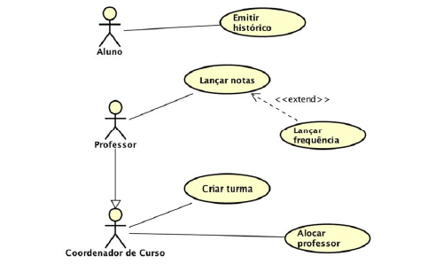
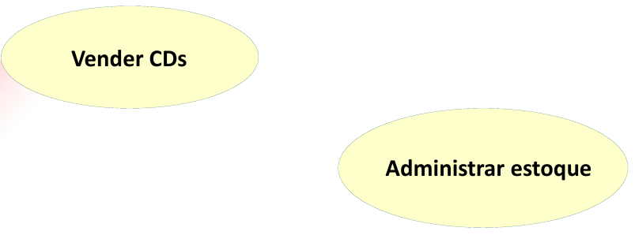
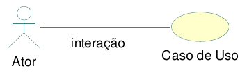
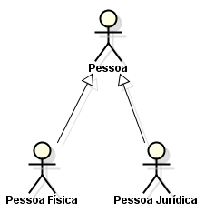
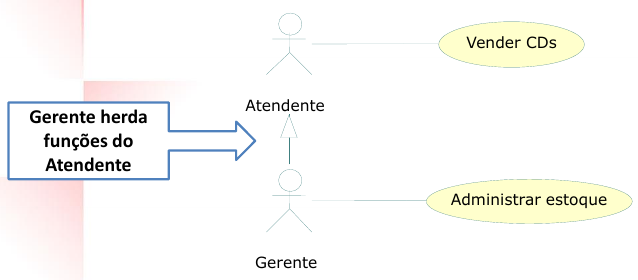
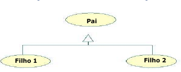
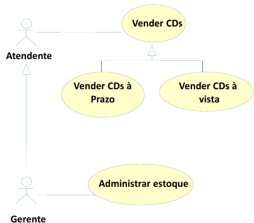
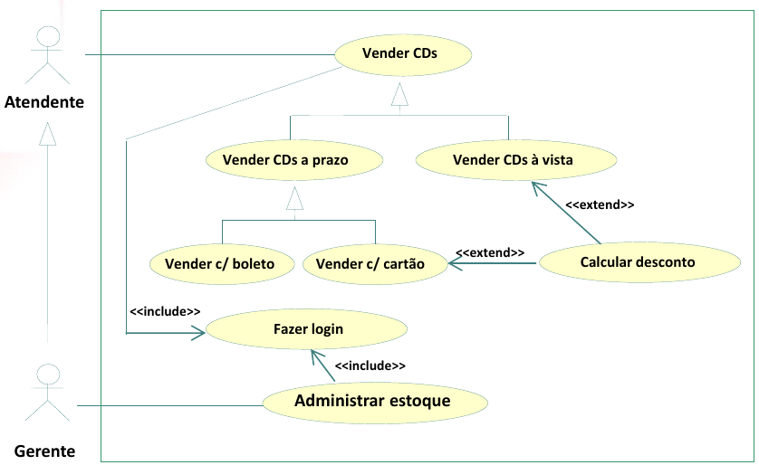

# Projeto Integrador
Brookiê

Desenvolvimento do Projeto Integrador do Curso Técnico em Desenvolvimento de Sistemas para a Internet Integrado ao Ensino Médio do IFC – Campus Araquari.

O projeto Brookiê consiste no desenvolvimento de uma plataforma de comércio eletrônico voltada para a venda de cookies e brownies. O sistema permitirá que clientes visualizem produtos, realizem pedidos online e efetuem pagamentos de forma segura. Além disso, a plataforma contará com um painel administrativo para controle de vendas, estoque e análise financeira do negócio. O objetivo é oferecer uma experiência de compra simples e eficiente para os clientes, ao mesmo tempo em que fornece ferramentas de gestão para o administrador da loja.

Professor: [Marco André Mendes](github.com/marcoandre)

Equipe:
- [Arthur Lanznaster](https://github.com/arthurlanz)
- [Clara Tesser Carvalho](https://github.com/claratesser)
- [Gabriel Sombrio](https://github.com/gaSombrio)
- [Maria Heloiza Vitoreti](https://github.com/mariavitoreti)

Links do projeto:
-   [Documentação (esse documento)](https://github.com/EquipePI-3info2/DocumentacaoBrookie)
-   Backend: [Repositório](https://github.com/EquipePI-3info2/backend) e [Publicação](https://pi-backend.herokuapp.com/)
-   Frontend: [Repositório](https://github.com/EquipePI-3info2/frontend) e [Publicação](https://pi-frontend.herokuapp.com/)

# 1. Desenvolvimento
O sistema desenvolvido neste projeto se enquadra no modelo de Ponto de Vendas (PDV) aplicado ao comércio eletrônico.

O projeto tem como objetivo desenvolver um sistema que permita a venda online de produtos alimentícios, especificamente cookies e brownies. A escolha desse modelo se deve ao fato de que muitos pequenos negócios do setor alimentício dependem de processos manuais ou de redes sociais para realizar vendas, o que dificulta a organização de pedidos, o controle de estoque e a análise de resultados financeiros.

A implementação de um sistema digital permitirá centralizar essas informações em uma única plataforma, automatizando processos e facilitando tanto a compra pelos clientes quanto a gestão do negócio pelo administrador.

# 2. Situação Problema

A empresa Brookiê atua no ramo alimentício, produzindo e vendendo cookies e brownies artesanais. O negócio iniciou como uma pequena produção caseira e cresceu gradualmente com o aumento da demanda, principalmente por meio de pedidos realizados pelas redes sociais e aplicativos de mensagens.

Atualmente, todo o processo de vendas é realizado de forma manual. Os clientes entram em contato com a loja por mensagens para solicitar informações sobre os produtos disponíveis, preços e formas de entrega. Após o pedido ser realizado, os dados são anotados manualmente pelos responsáveis pela loja, incluindo nome do cliente, produtos solicitados, quantidades e endereço de entrega.

Esse método apresenta diversos problemas operacionais. A ausência de um sistema centralizado dificulta o controle dos pedidos recebidos, o que pode resultar em erros de anotação, perda de informações ou atrasos na preparação das encomendas. Além disso, o controle de estoque também é feito manualmente, tornando difícil saber com precisão a quantidade disponível de cada produto.

Outro problema identificado é a falta de dados consolidados sobre as vendas realizadas. Como as informações ficam espalhadas em anotações ou conversas de mensagens, torna-se complicado acompanhar o desempenho do negócio, identificar os produtos mais vendidos ou calcular corretamente o faturamento e o lucro obtido.

Além disso, o processo de compra para os clientes acaba sendo mais demorado, pois depende da interação direta com o vendedor para verificar disponibilidade, registrar o pedido e combinar o pagamento.

Diante dessas dificuldades, torna-se necessário implementar um sistema que automatize o processo de vendas, organize os pedidos e forneça ferramentas de gestão que auxiliem na administração do negócio.

# 3. Descrição da proposta

A proposta do projeto consiste no desenvolvimento de um sistema de e-commerce para a loja Brookiê, permitindo que clientes realizem pedidos de cookies e brownies diretamente pela plataforma.

O sistema será dividido em dois níveis principais de usuários: clientes e administradores.

Para os clientes, o sistema permitirá a criação de uma conta, login na plataforma, visualização do catálogo de produtos, busca por itens específicos e adição de produtos ao carrinho de compras. Após selecionar os produtos desejados, o usuário poderá informar o endereço de entrega e finalizar a compra utilizando um sistema de pagamento integrado. O cliente também poderá visualizar seu histórico de pedidos e acompanhar as informações relacionadas às compras realizadas.

Para o administrador, o sistema oferecerá um painel de gerenciamento que permitirá cadastrar, editar e remover produtos do catálogo, controlar o estoque e acompanhar os pedidos realizados pelos clientes. Além disso, o painel apresentará indicadores importantes para a gestão do negócio, como número de vendas realizadas, valor total de vendas, controle de estoque e cálculo de lucro bruto e líquido.

Com a implementação dessa solução, espera-se melhorar a organização dos pedidos, reduzir erros operacionais e proporcionar uma experiência de compra mais rápida e prática para os clientes, além de fornecer ferramentas de análise e controle para a administração da loja.

# 4. Modelagem de Dados

# 4. Regras de negócio
(*Nessa parte a equipe deve descrever as regras de negócio que serão implementadas no sistema. O texto abaixo descreve o que essa etapa deve conter e pode ser apagado depois.*)

As **Regras de negócio** são orientações e restrições que ajudam a regular as operações de uma empresa. **Regras** foram criadas para **colaborar com o funcionamento**, seja da sociedade, de uma escola, de um jogo, etc. Não seria diferente nas organizações. Vamos abordar melhor sobre esse assunto. Entender o que são as regras de negócio, sua importância, como são aplicadas e
automatizadas na gestão por processo.

**4.1 O que são regras de negócio?**

Um negócio funciona por processos que, por sua vez, são formados por atividades relacionadas entre si.

As funções das áreas de compras, estoque, logística, finanças, vendas e marketing, por exemplo, compõem um processo de fornecimento de um produto ao cliente.

Dentro desses processos, existem regras que devem ser seguidas durante a execução das atividades, que ajudam a definir **COMO** as operações devem ser realizadas e gerenciadas, **POR QUEM**, **QUANDO**, **ONDE** e **POR QUÊ**.

Podemos dizer que as regras de negócio são **limites impostos às operações**, de forma que elas sigam corretamente em direção às políticas e aos objetivos da instituição.

**4.2 Regras para a criação de regras de negócio**

De maneira geral, as regras de negócio devem:
- Ser **simples**, isto é,  ter apenas uma função.
- Ser **completas**, com início, meio e fim.
- Ser possíveis de **mensurar** e **rastrear**.
- Estar em consonância com a **legislação**.
- Estar **atualizadas** e sempre **revisadas**.
- Refletir a **política** e os **valores** da organização.
- Ser **inteligíveis** para os colaboradores e envolvidos no processo.

**4.3 Por que ter regras de negócio?**

- **Padronização de processos:** padronizam os processos e auxiliam a fluirem de forma mais eficiente e automatizada.
- **Controle de processos:** auxiliam no controle de processos, pois falhas são identificadas e corrigidas mais rapidamente.
- **Tomada de decisão:** auxiliam na tomada de decisão e no cumprimento de estratégias pré-estabelecidas.

**4.4 Exemplos de regras de negócio**

- Em um controle de qualidade de granja, pode-se dizer que a cada 100 ovos impróprios para consumo, o lote será descartado.
- Em um banco, clientes com faturamento mensal de mais de R$ 25 mil e CPF sem restrições, serão atendidos pelo gerente Premium pessoa física.
- Para conclusão de licitações, devem ser feitos três orçamentos e o vencedor será sempre o de menor preço final.
- Em um processo de seleção de RH, o candidato só pode ser aprovado se tiver mais de 5 anos de experiência na área, diploma de pós-graduação, espanhol fluente e pretensão salarial abaixo de R$ 8.000,00.
- Em um processo de vendas, o vendedor só pode vender um produto se o cliente tiver mais de 18 anos, renda familiar acima de R$ 5.000,00 e não tiver restrições no CPF.
- Em um processo de compras, o fornecedor só pode ser contratado se tiver nota fiscal, certificado de qualidade e preço abaixo de R$ 10,00 por unidade.
- Em um processo de logística, o pedido só pode ser enviado se o cliente tiver mais de 18 anos, endereço de entrega no mesmo estado e não tiver restrições no CPF.

**4.5 Como escrever regras de negócio?**

- Número identificador.
- Nome da regra.
- Data de criação e data da última alteração para comparações e
controle.
- Nome dos Autores das versões.
- Número da versão (1, 2 etc).
- Dependências: insira o identificador das regras atreladas, às quais a regra em questão depende.
- Uma descrição detalhada para compreensão da regra.

**4.6 Exemplos de regras de negócio com formatação**

- **RN01 – Criação Comanda:** Para iniciar um atendimento no balcão, é necessário primeiro abrir uma nova comanda.
- **RN02 – Inserir Produtos Comanda:** Para inserir um produto na comanda, é necessário que o produto esteja cadastrado no sistema e que a quantia comprada seja acima de zero.
- **RN03 – Cadastro de Leitores:** Os leitores precisam fazer o cadastro para realizar o empréstimo.
- **RN04 – Realizar Empréstimo:** Para realizar o empréstimo, apenas leitores com cadastro e nenhuma multa em aberto.
- **RN05 – Registro de Empréstimo:** O gerente deve possuir acesso aos registros de empréstimos.
- **RN06 – Pagamento de Multa:** O leitor que passar de 15 dias com o livro deverá pagar a multa de um real por dia de atraso.
- **RN07 – Impressão de Orçamento:** Com as informações do
orçamento registradas, a atendente deve imprimir o orçamento e
repassar ao cliente para aprovação, e caso o cliente aprovar, a atendente deve solicitar a sua assinatura para aprovar a execução do serviço.
- **RN08 – Abertura de OS:** Com o atendimento aprovado pelo cliente, a atendente deverá inserir os dados do cliente e do orçamento em um novo documento, para registros internos, realizando a abertura da OS.
- **RN09 – Relatório de Fluxo de Caixa:** O relatório de fluxo de caixa será permitido somente para o administrador.

# 5. Requisitos funcionais
(*Nessa parte a equipe deve descrever os requisitos funcionais que serão implementados no sistema. O texto abaixo descreve o que essa etapa deve conter e pode ser apagado depois.*)

**5.1 O que são requisitos funcionais?**

Um requisito funcional é uma declaração de como um sistema deve se comportar. Define o que o sistema deve fazer para atender às necessidades ou expectativas do usuário. Os requisitos funcionais podem ser pensados ​como recursos que o usuário detecta.

Os requisitos funcionais são compostos de duas partes:
**função** e **comportamento**.

- A **função** é o que o sistema **faz**. Por exemplo: *“calcular imposto sobre vendas”*.
- O **comportamento** é **como** o sistema faz. Por exemplo: *“O sistema deve calcular o imposto sobre vendas multiplicando o preço de compra pela alíquota do imposto.”*.

**5.2 Tipos de requisitos funcionais**

Os requisitos funcionais podem ser classificados em:

- Regulamentos de Negócios
- Requisitos de Certificação
- Requisitos de relatório
- Funções Administrativas
- Níveis de autorização
- Rastreamento de auditoria
- Interfaces Externas
- Gestão de dados
- Requisitos Legais e Regulamentares

**5.3 Diretrizes para a elaboração de requisitos funcionais**

Cada requisito funcional precisa ser:

- **Específico** sobre o que o sistema deve fazer.
- **Mensurável** para que você possa dizer se o sistema está fazendo isso
- **Alcançável** dentro do prazo que você definiu
- **Relevante** para seus objetivos de negócios
- **Limitado** no tempo para que você possa
acompanhar o progresso

**5.4 Estrutura do requisito funcional**

Um requisito funcional deve ser estruturado da seguinte forma:

- **Nome do requisito funcional:** descrição do
requisito.
  - **Dados necessários:** dado 1, dado 2, dado 3.
  - **Usuários:** todos os níveis de usuário.

**5.4.1 Nome do requisito funcional**

**R.F. 99 - Nome do requisito funcional:** é o nome da função que o software terá. Sugerimos, por padronização, que tenha o prefixo R.F. (requisito funcional)
seguida da numeração, para melhor identificação do requisito, acrescido do formato *“Substantivo + onde será feita a ação”*.
Por exemplo:
- R.F. 01 - Registro de Funcionários
- R.F. 15 - Gerenciamento de consultas
- R.F. 04 - Débito em conta corrente

Deixe para definir as numerações ao final, tendo em vista que mudanças podem acontecer e não é prático sempre ficar reajustando os números.

**5.4.2 Descrição do requisito funcional**

**Descrição do requisito:** local para descrever a função deste requisito.

Sempre se preocupe em esclarecer dois pontos: o que o requisito faz e o motivo de sua existência. Isso é especialmente importante se a ação executada nesse requisito não for algo que já acontece naturalmente na empresa.
Um exemplo é um Registro de funcionários, que talvez não exista hoje mas para o software é necessário para viabilizar uma autenticação de
usuários. Outro exemplo é algo que faz sentido apenas para um  software, como a própria autenticação.

**5.4.3 Dados necessários**

**Dados necessários:** aqui devem ser colocados os nomes dos dados que serão usados para que esse requisito atenda o que precisa fazer.

Nas **entradas** e **processos**, em geral, são os dados que serão salvos (seja algo digitado pelo usuário ou captado do sistema, como a hora atual).

Já nas **saídas**, são os dados que serão exibidos em tela (sejam eles vindos diretamente do banco, ou criados por um cálculo ou busca na sessão do usuário).

**5.4.4 Usuários**

**Usuários:** aqui devem ser colocados os nomes dos usuários que terão acesso a esse requisito, conforme enumerados na descrição do sistema.

**5.4.5 Exemplo de requisito funcional**

- **R.F. 01 - Autenticação de usuário:** tem como propósito autenticar o acesso ao sistema, verificando se o usuário pode acessá-lo e, caso possa, o direcionando
para a página principal de seu perfil de acesso.
  - **Dados necessários:** login, senha, nível de permissão.
  - **Usuários:** todos os níveis de usuário.

**5.4.6 Organização dos requisitos funcionais**

As funcionalidades devem ser organizadas em: entradas, processos e saídas.

**Entradas:** São as funcionalidades que alimentarão o software com as informações essenciais para seu uso.

**Exemplos de entradas:**
- “**Registro de usuário**” (para permitir depois seu acesso ao software).
- “**Registro de paciente**” (que seria útil caso nosso software fosse ppara uma clínica, evitando registrar várias vezes os mesmos dados da pessoa a cada consulta e viabilizando um histórico de seus
atendimentos).

**Processos:** Em geral, englobam toda ação que executa cálculos, processamentos de tomada de decisão ou transforma dados em novos dados.

**Exemplos de processos:**
- “**Autenticação de usuário**”, que usará os dados de “**Registro de usuário**” em sua execução.
- “**Agendamento de consulta**”, que usará dados do “**Registro de paciente**” e talvez do “**Registro de funcionário**” em sua execução.

**Saídas:** São os relatórios, gráficos, impressões, etc., que utilizarem os dados do software para gerar informações pertinentes ao
negócio, mas sem intenção de alterá-los, apenas permitindo sua visualização e filtragem.

**Exemplos de saídas:**
- “Relatório de consultas por paciente”.
- Relatório de vendas”.
- “Log de usuários autenticados”.

Todos esses podem ser consideradas saídas, pois usam informações de entradas e processos de modo a mostrar informações relevantes ao
negócio. Lembre-se que, diferentemente das entradas e processos, aqui os dados necessários devem ser os que a tela exibirá.

**5.4.7 Exemplo de organização dos requisitos funcionais**

RF001: O sistema deve manter usuários com nome, e-mail, senha e telefone.
RN001.01: O e-mail do usuário deve ser único no sistema, não sendo permitido o cadastro de dois usuários com o mesmo e-mail.
RN001.02: Os campos nome, e-mail e senha são obrigatórios no cadastro.
RN001.03: O e-mail deve estar em formato válido.

RF002: O sistema deve permitir autenticação de usuários cadastrados por e-mail e senha.
RN002.01: Apenas usuários previamente cadastrados podem realizar login no sistema.
RN002.02: O acesso só será permitido quando e-mail e senha informados forem válidos.
RN002.03: Após autenticação bem-sucedida, o sistema deve iniciar a sessão do usuário.

RF003 – O sistema deve permitir o cadastro, edição e exclusão de endereços de entrega associados ao usuário.
RN003.01: Cada usuário pode cadastrar múltiplos endereços de entrega.
RN003.02: Apenas o próprio usuário pode editar ou excluir seus endereços.
RN003.03: Para realizar um pedido, o usuário deve possuir ao menos um endereço cadastrado.

RF004 – O sistema deve manter produtos (cookies e brownies) com nome, descrição, preço, categoria, imagens e quantidade em estoque.
RN004.01: Todo produto deve possuir nome, preço, categoria e quantidade em estoque.
RN004.02: O preço do produto deve ser maior que zero.
RN004.03: A quantidade em estoque não pode ser negativa.

RF005 – O sistema deve permitir ao administrador realizar operações de criação, leitura, atualização e exclusão (CRUD) de produtos.
RN005.01: Apenas usuários com perfil de administrador podem cadastrar, editar ou excluir produtos.
RN005.02: Alterações realizadas em produtos devem ser registradas no sistema.

RF006 – O sistema deve organizar os produtos por categorias.
RN006.01: Todo produto deve obrigatoriamente estar associado a uma categoria.
RN006.02: Uma categoria pode possuir múltiplos produtos.

RF007 – O sistema deve permitir que usuários visualizem o catálogo de produtos e filtrem por categoria ou nome.
RN007.01: O catálogo deve exibir apenas produtos disponíveis para venda.

RF008 – O sistema deve exibir os detalhes completos de um produto selecionado.
RN008.01: A página do produto deve exibir nome, descrição, preço, imagens e disponibilidade em estoque.
RN008.02: Caso o produto esteja sem estoque, essa informação deve ser exibida ao usuário.

RF009 – O sistema deve permitir que usuários adicionem produtos ao carrinho de compras.
RN009.01: Apenas usuários autenticados podem adicionar produtos ao carrinho.
RN009.02: A quantidade adicionada ao carrinho não pode ultrapassar o estoque disponível.

RF010 – O sistema deve permitir que usuários alterem quantidades ou removam produtos do carrinho.

RF011 – O sistema deve processar pagamentos por meio da API do Mercado Pago.

RF012 – O sistema deve registrar pedidos confirmados após a aprovação do pagamento.

RF013 – O sistema deve manter o histórico de pedidos do usuário.
RN013.01: O histórico deve apresentar data, valor total e status do pedido.

RF014 – O sistema deve permitir ao administrador visualizar todos os pedidos realizados.

RF015 – O sistema deve permitir ao administrador atualizar o status dos pedidos.
RN015.01: O status do pedido pode assumir valores como: pendente, em preparação, enviado ou concluído.

RF016 – O sistema deve atualizar automaticamente o estoque conforme os pedidos confirmados.

RF017 – O sistema deve permitir o cadastro de despesas operacionais pelo administrador.
RN017.01: Cada despesa deve possuir descrição, valor e data.

RF018 – O sistema deve calcular automaticamente o valor total de vendas.
RN018.01: O total de vendas deve considerar apenas pedidos com pagamento confirmado.

RF019 – O sistema deve calcular automaticamente o lucro bruto com base nas vendas.
RN019.01: O lucro bruto deve ser calculado automaticamente com base no valor total de vendas registradas.

RF020 – O sistema deve calcular automaticamente o lucro líquido considerando as despesas cadastradas.
RN020.01: O lucro líquido deve ser calculado subtraindo as despesas operacionais do valor total de vendas.

RF021 – O sistema deve exibir, no painel administrativo, indicadores de vendas, pedidos, estoque e resultados financeiros.

# 6. Requisitos não funcionais

Requisitos não funcionais (**RNFs**) são as restrições impostas a um sistema que definem seus atributos de qualidade.

Eles geralmente são indicados por adjetivos como **segurança**, **desempenho** e **escalabilidade**.

**6.1 Categorias de requisitos não funcionais**

Os requisitos não funcionais são importantes porque ajudam a garantir que o sistema atenda às necessidades do usuário.

Os Requisitos Não Funcionais explicam as limitações e restrições do sistema a ser projetado. **Esses requisitos não têm nenhum
impacto na funcionalidade do aplicativo.** Além disso, existe uma prática comum de subclassificar os requisitos não funcionais em várias categorias:

- Interface de Usuário
- Confiabilidade
- Segurança
- Atuação
- Manutenção

Os requisitos não funcionais podem ser divididos em duas categorias:

1. **Atributos de qualidade:** Estas são as características do sistema que determinam sua qualidade geral. Exemplos de atributos de qualidade incluem segurança, desempenho e usabilidade.
2. **Restrições:** Estas são as limitações impostas ao sistema.
Exemplos de restrições incluem tempo, recursos e ambiente.

**6.2 Vantagens dos requisitos não funcionais**

Os requisitos não funcionais ajudam a garantir que o sistema seja:

1. Adaptado às necessidades do usuário.
2. Adequado à finalidade.
3. Escalável, seguro e confiável.
4. Fácil de usar e manter.

**6.3 Exemplos de requisitos não funcionais**

Aqui estão alguns exemplos de requisitos não funcionais:
1. **Segurança**: O sistema deve ser protegido contra acesso não
autorizado.
2. **Atuação**: O sistema deve ser capaz de lidar com o número necessário
de usuários sem qualquer degradação no desempenho.
3. **Escalabilidade**: O sistema deve ser capaz de aumentar ou diminuir
conforme necessário.
4. **Disponibilidade**: O sistema deve estar disponível quando necessário.
5. **Manutenção**: O sistema deve ser fácil de manter e atualizar.
6. **Portabilidade**: O sistema deve ser capaz de rodar em diferentes
plataformas com alterações mínimas.
7. **Confiabilidade**: O sistema deve ser confiável e atender aos requisitos
do usuário.
8. **Usabilidade**: O sistema deve ser fácil de usar e entender.
9. **Compatibilidade**: O sistema deve ser compatível com outros sistemas.
10. **Conformidade**: O sistema deve cumprir todas as leis e regulamentos
aplicáveis.

**6.4 Exemplo de organização dos requisitos não funcionais**

RNF001 – O sistema deve ser desenvolvido para ambiente web, acessível por navegadores modernos.

RNF002 – O sistema deve possuir interface responsiva, adaptando-se corretamente a dispositivos móveis, tablets e desktops.

RNF003 – O sistema deve funcionar como uma Progressive Web App (PWA), permitindo a instalação no dispositivo do usuário.

RNF004 – O sistema deve garantir tempo de resposta inferior a 3 segundos para operações comuns (login, listagem de produtos, carrinho e pedidos).

RNF005 – O sistema deve utilizar comunicação segura via protocolo HTTPS.

RNF006 – As senhas dos usuários devem ser armazenadas de forma criptografada.

RNF007 – O sistema deve garantir a integridade das transações financeiras realizadas por meio da API do Mercado Pago.

RNF008 – O sistema deve ser capaz de suportar múltiplos usuários simultâneos sem degradação perceptível de desempenho.

RNF009 – O sistema deve possuir controle de acesso baseado em perfis (usuário e administrador).

RNF010 – O sistema deve manter persistência dos dados em banco de dados relacional ou equivalente, garantindo consistência das informações.

RNF011 – O sistema deve garantir disponibilidade mínima de 99% em ambiente de produção.

RNF012 – O sistema deve permitir manutenção evolutiva, seguindo padrões de desenvolvimento que facilitem atualização e correção.

RNF013 – O sistema deve registrar logs de operações críticas (login, pedidos, pagamentos e alterações administrativas).

**6.6 Conclusão**

Requisitos não funcionais são essenciais para qualquer sistema. Eles ajudam a garantir que o sistema atenda às necessidades do usuário e seja capaz de funcionar como pretendido.

É importante considerar cuidadosamente todos os requisitos não funcionais antes de projetar e desenvolver um sistema.
Eles ajudam a garantir que o sistema atenda às necessidades do usuário e seja capaz de funcionar como pretendido.

# 7. Diagrama de Caso de Uso

**7.1 Introdução**

O diagrama de caso de uso é uma ferramenta de modelagem que descreve o comportamento de um sistema a partir da perspectiva do usuário. Ele é usado para capturar os requisitos funcionais de um sistema.

- Especificam a visão externa do sistema.
- Descrevem como o sistema é percebido por seus usuários.
- Descrevem as interações entre os usuários e o sistema.

**Os casos de uso:**
- Descrevem como os **usuários interagem com o sistema** (as funcionalidades do sistema)
- Facilitam a **organização dos requisitos** de um sistema.
- Dão uma **visão externa** do sistema
- O conjunto de casos de uso deve ser capaz de comunicar a **funcionalidade** e o **comportamento** do sistema para o cliente.
- Descrevem **o que** o sistema faz, mas **não** especificam **como** isso deve ser feito.

**7.2 Elementos do diagrama de caso de uso**

7.2.1 **Atores**

- Representam os papéis desempenhados por **elementos externos** ao sistema
  - Ex: humano (usuário), dispositivo de hardware ou outro sistema (cliente)
- Elementos que **interagem** com o sistema

Notação:

**Exemplo: Loja de CDs**

**Identificando os atores**
- Uma loja de CDs possui discos para venda. Um cliente pode comprar uma quantidade ilimitada de discos para isto ele deve se dirigir à loja.
- A loja possui um **atendente** cuja função é atender os clientes durante a venda dos discos. A loja também possui um **gerente** cuja função é administrar o estoque para que não faltem discos. Além disso é ele quem dá folga ao atendente, ou seja, ele também atende os clientes durante a venda dos discos.

**E o cliente?**
- Não é ator pois ele **não interage** com o sistema!

**7.2.2 Casos de uso**

- Representam **funcionalidades** do sistema (requisitos funcionais).
- São iniciados por **atores** ou por outros casos de uso.

> **Dica**: nomeie os casos de uso com **verbos** no **infinitivo**.

Notação:

**Exemplo: Loja de CDs**

**Identificando os casos de uso**

- Uma loja de CDs possui discos para venda. Um cliente pode comprar uma quantidade ilimitada de discos para isto ele deve se dirigir à loja. A loja possui um atendente cuja função é atender os clientes durante a **venda dos discos**.
- A loja também possui um gerente cuja função é **administrar o estoque** para que não faltem discos. Além disso é ele quem dá folga ao atendente, ou seja, ele também atende os clientes durante a **venda dos discos**.

**7.2.3 Relacionamentos**

**7.2.3.1 Relacionamento de associação**

- Indica que um ator **participa** de um caso de uso, ou seja, o ator **interage** (comunica-se) com o caso de uso.
- É representado por uma **linha sólida**.
- Um ator pode se relacionar com **um ou mais casos de uso**.

> Dicas:
> - Não use setas nas linhas de associação.
> - Associações não representam fluxo de informação.

**Exemplo: Loja de CDs**

**Identificando os relacionamentos de associação**

- Uma loja de CDs possui discos para venda. Um cliente pode comprar uma quantidade ilimitada de discos para isto ele deve se dirigir à loja. A loja possui um _atendente_ cuja função é atender os clientes durante a **venda dos discos**.
- A loja também possui um _gerente_ cuja função é **administrar o estoque** para que não faltem discos. Além disso é ele quem dá folga ao _atendente_, ou seja, ele também atende os clientes durante a **venda dos discos**.

**7.2.3.2 Relacionamento de generalização/especialização**

**Generalização de atores**

- Quando dois ou mais atores podem se **comunicar com o mesmo conjunto de casos de uso**.
- Indica que um ator **herda** as características de outro ator.
– Um filho (herdeiro) pode se comunicar com todos os casos de uso que seu pai se comunica.

> **Dica:** coloque os herdeiros **embaixo**.

**Notação:**

**Exemplo: Loja de CDs**

**Identificando os relacionamentos de generalização/especialização de atores**

**Generalização de casos de uso**

– O caso de uso filho herda o comportamento e o significado do caso de uso pai.
– O caso de uso filho pode incluir ou sobrescrever o comportamento do caso de uso pai.
– O caso de uso filho pode substituir o caso de uso pai em qualquer lugar que ele apareça.

> **Dica:** deve ser aplicada quando uma condição resulta na definição de
diversos fluxos alternativos.

Notação:

**Exemplo: Loja de CDs**

**Identificando os relacionamentos de generalização/especialização de casos de uso**

**Novos requisitos:**

- As vendas podem ser **à vista** ou **a prazo**. Em ambos os casos o estoque é
atualizado e uma nota fiscal, entregue ao consumidor.
- No caso de uma **venda à vista**, clientes cadastrados na loja e que compram mais de 5 CDs de uma só vez ganham um desconto de 1% para cada ano de cadastro.
- No caso de uma **venda a prazo**, ela pode ser parcelada em 2 pagamentos com um
acréscimo de 20%. As vendas a prazo podem ser pagas no **cartão** ou no **boleto**.
  - Para pagamento com **boleto**, são gerados boletos bancários que são entregues ao cliente e armazenados no sistema para lançamento posterior no caixa.
  - Para pagamento com **cartão**, os clientes com mais de 10 anos de cadastro na loja ganham o mesmo desconto das compras à vista.

**Identificando mais relacionamentos de generalização/especialização de casos de uso**

**7.2.3.3 Relacionamento de dependência**

**Extensão**

- Representa uma variação/extensão do comportamento do caso de uso base.
- O caso de uso estendido só é executado sob certas circunstâncias.
- Separa partes obrigatórias de partes opcionais.
  - Partes obrigatórias: caso de uso base.
  - Partes opcionais: caso de uso estendido.
- Fatorar comportamentos variantes do sistema (podendo reusar este comportamento
em outros casos de uso).

**Notação:**

 - notação")

**Exemplo: Loja de CDs**

**Identificando os relacionamentos de dependência (extensão)**

**Novos requisitos:**
- No caso de uma venda à vista, clientes cadastrados na loja e que compram mais
de 5 CDs de uma só vez ganham um **desconto** de 1% para cada ano de cadastro.
- No caso de uma venda a prazo...
  - ...Para pagamento com cartão, os clientes com mais de 10 anos de cadastro na loja ganham o mesmo **desconto** das compras à vista.

")

**Inclusão**

- Evita repetição ao fatorar uma atividade
comum a dois ou mais casos de uso.
- Um caso de uso pode incluir vários casos de uso.

**Notação:**

 - notação")

**Exemplo: Loja de CDs**

**Novos requisitos:**
Para efetuar vendas ou administrar estoque, atendentes e gerentes terão que **validar** suas respectivas senhas de
acesso ao sistema.

")

**7.2.4 Fronteira do sistema**

- Elemento opcional (mas essencial para um bom
entendimento).
- Serve para definir a área de atuação do sistema, ou seja, seus limites.

**Identificando a fronteira do sistema**

---

